# Fix 0.4.0-testing.0 after Gemini overreach

## Correct consumer model (source of truth)

### Design intent

A shader is a **self-contained, named, callable unit**. Everything it needs lives in the `.slab` (type, uniforms, GLSL, what may change from outside). The **call site only expresses what differs** from that declaration — no manual imports, no `useShader` / `feedFrom` assembly in userland.

**The slab is the source of truth.** The browser never loads or evaluates `.slab` at runtime; the Vite plugin compiles libraries at build time into WebGL2 programs + typed metadata the transform consumes.

### The four concepts

**1. `shader_frame` — the system and the call**


`shader_frame` is the new top-level **authoring and consumption** API exported from `@yoruxiii/shaderlab`. At a use site (page / component / bound element), writing:

```ts
shader_frame.water(liquids.slab)
```

**is the call** that applies the `water` frame from the `liquids.slab` library to **that element**. It is not “import a module and wire it yourself” — the expression is how you attach the shader. Framework adapters lower or bind this call to the host element (canvas / container).

**2. `.slab` file — the shader library**

Like a stylesheet holding named classes: one file, many `<shader_frame>` definitions. Split by theme (`liquids.slab`, `ui.slab`, …) or one file per project — call sites pull whichever library they need. Build-time only.

**3. Frame id (e.g. `.water`) — the callable name**

Inside the slab:

```xml
<shader_frame id="water" type="canvas_item"> … </shader_frame>
```

`id="water"` becomes **`shader_frame.water(...)`** at the call site. The **frame** is the unit (not the file, not a raw GLSL string): type = pipeline role, uniforms = surface area, GLSL = GPU program.

**4. Options block `{}` — the only place the call site speaks**

```ts
shader_frame.water(liquids.slab) {
  speed: 1.2,
  tint: [0.1, 0.4, 0.8]
}
```

| Slab declaration | Options object |
|------------------|----------------|
| `mutable="true"` | Valid key; may override default |
| sealed (default) | **Absent** from generated TS type; setting it → compile error |
| `deferred="true"` | Expected here (no real default); required when applicable |

Fully sealed frames → **no `{}`**; one line is enough.

TypeScript types for `{}` are **generated from the slab** so TS catches bad keys before ShaderLab diagnostics.

**Augments inside `{}` — positional pipeline at the call site**

Augments are part of the options block, not a separate concept. They are `spatial` + `mode="augment"` frames that process a `canvas_item` output before screen / postprocess. Declared **inside the same options block**, but **not key-value pairs** — positional calls:

```ts
shader_frame.water(liquids.slab) {
  speed: 1.2,
  augment.ripple(spatials.slab),
  augment.caustics(spatials.slab)
}
```

- **Load order = declaration order** (ripple first, caustics second). No priority, inference, or runtime negotiation.
- Each augment is its own `shader_frame` call (`frame id` + library `.slab`).
- Nested overrides: `augment.ripple(spatials.slab) { amplitude: 0.4 }`
- **Pipeline for that element is readable from this one site** — not from file layout or import order.

```mermaid
flowchart TB
  subgraph slab [Build time - liquids.slab]
    Def["shader_frame id=water\nuniforms + GLSL"]
    Compile["Vite: compileSlab"]
    Registry["Frame registry +\nper-frame metadata"]
  end
  subgraph callsite [Use site - on element]
    Call["shader_frame.water(liquids.slab) { }"]
  end
  subgraph build [Vite transform]
    Lower["Lower call + options +\naugment.* to runtime wiring"]
  end
  subgraph runtime [Browser]
    Bind["Bind to host element"]
    Chain["canvas_item → augments → post"]
  end
  Def --> Compile --> Registry
  Call --> Lower
  Registry --> Lower
  Lower --> Bind --> Chain
```

**Out of scope for 0.4.0** (per spec §12): `<contract>` / `consumes` / `produces` / `exclusive_with`, **E05xx**, contract-aware typing, dynamic augment add/remove after mount.



---

## What Gemini broke (current uncommitted state)

**Partially correct (keep / finish):**
- Slab parser for `<shader_frame>`, `version="2.0"`, `mutable`/`deferred`, spatial `mode` ([`src/compiler/parser.ts`](src/compiler/parser.ts), [`src/compiler/validator.ts`](src/compiler/validator.ts))
- E04xx/W04xx registry in [`src/compiler/errors.ts`](src/compiler/errors.ts) (meanings match spec, not CHANGELOG’s wrong descriptions)
- Mutable-only d.ts filtering ([`src/compiler/types-emit.ts`](src/compiler/types-emit.ts))
- `ShaderFrameInstance` + augment wiring sketch in [`src/vite/runtime.ts`](src/vite/runtime.ts)

**Wrong / out of scope (remove or rewrite):**
- **0.5.x artifacts:** [`test/compiler/augment-chain.test.ts`](test/compiler/augment-chain.test.ts), [`test/fixtures/e0501_augment_type_mismatch.slab`](test/fixtures/e0501_augment_type_mismatch.slab), [`test/fixtures/e0502_exclusive_with.slab`](test/fixtures/e0502_exclusive_with.slab), contract tests in [`test/compiler/shader-frame.test.ts`](test/compiler/shader-frame.test.ts), `<contract>` in [`test/fixtures/frame_chain_ok.slab`](test/fixtures/frame_chain_ok.slab)
- **0.3.x coexistence tests** that contradict 0.4 hard break: [`test/compiler/deprecation.test.ts`](test/compiler/deprecation.test.ts) (expects `W0401` warn on `<shader>`), legacy-compat cases in [`test/compiler/shader-frame.test.ts`](test/compiler/shader-frame.test.ts) / [`test/compiler/types-emit-mutable.test.ts`](test/compiler/types-emit-mutable.test.ts)
- **Wrong CHANGELOG/API copy:** claims E05xx + contracts are live; describes E04xx as “override” errors ([`CHANGELOG.md`](CHANGELOG.md), [`docs/API.md`](docs/API.md) “locking at 1.0.0”)
- **Deleted migration doc:** [`NEW_API.md`](NEW_API.md) removed; spec E0401 points authors at migration guidance
- **Missing consumer layer:** no `shader_frame` export, no Vite transform — plugin still emits `import { createShaderInstance } from "shaderlab"` + `__shaders` ([`src/vite/plugin.ts`](src/vite/plugin.ts)) while [`src/index.ts`](src/index.ts) no longer exports `createShaderInstance` (broken)
- **Deleted compositor:** [`src/runtime/use-shader.ts`](src/runtime/use-shader.ts) gone but [`test/runtime/use-shader.test.ts`](test/runtime/use-shader.test.ts) still imports it
- **~40 legacy fixtures** still `version="1.0"` + `<shader>` — all fail under new parser (intentional); tests not migrated

---

## Target architecture for 0.4.0-testing.0

### 1. Slab compiler (unchanged intent, tighten)

- **Hard break:** `<shader>` → `E0401`; any root `version !== "2.0"` → `E0402` ([`src/compiler/parser.ts`](src/compiler/parser.ts) — drop validator’s “accept 1.0” comment path)
- **Ignore unknown XML** like `<contract>` until 0.5 (do not parse/store `contract` on AST)
- **Emit per-frame metadata** for transform: frame id, type, mode, uniforms (`mutable`/`deferred`), GLSL, augment eligibility
- **Slab module output:** per-library **frame registry** (id → compiled program + metadata). Not a consumer-facing “import and assemble” module; the registry exists for the transform to resolve `shader_frame.water(liquids.slab)`.

### 2. Vite `shader_frame` transform (new — core missing piece)

Add a transform pass (esbuild via Vite `transform` hook) for `.{ts,tsx,js,jsx,vue,svelte}` that recognizes **non-JS surface syntax** and lowers each **call site** (including element bindings in templates) to runtime wiring:

| Source (invalid JS) | Lowered to (conceptually) |
|---------------------|---------------------------|
| `shader_frame.water(liquids.slab)` | `__shaderFrame("water", liquids_slab, undefined)` |
| `shader_frame.water(liquids.slab) { speed: 1.2 }` | options object literal after validation |
| `augment.ripple(spatials.slab)` | `{ kind: "augment", frameId: "ripple", slab: spatials_slab, loadIndex: n }` |
| `augment.ripple(spatials.slab) { amplitude: 0.4 }` | augment + nested overrides |

**Transform responsibilities:**
- Resolve `*.slab` import/reference to compiled module + frame id existence (`E0408`-class errors at build time when frame missing or wrong type/mode)
- Validate options keys against emitted metadata (mutable/deferred only) — **E04xx at build time**, not runtime surprises
- Assign `loadIndex` from positional order of `augment.*` in the block
- Reject augments on `postprocess` targets (`E0404`)

**Note:** `augment.foo(...)` inside `{}` requires a custom parser (not TypeScript’s `{}` — treat the block as a structured DSL fragment, similar to how Vue SFC compiles script).

### 3. Public runtime export

From [`src/index.ts`](src/index.ts):

- Export **`shader_frame`** as the **callable system** (Proxy or equivalent): `shader_frame.<frameId>(<library.slab>[, options])` — this is what authors write on the page; it must know frame + library and bind to the target element when used in framework context.
- Keep **`createShaderInstance`** as **internal** (lowered output / `shaderlab/vite` only) — not documented consumer API.
- **`ShaderFrameInstance`** — the object the transform produces and the adapter consumes. Carries `mount(element)`, `unmount()`, and `set(param, value)` for runtime mutation of deferred/mutable uniforms. Element binding is handled through the adapter, not by the author calling `mount()` manually in app code.

### 4. Framework adapters

Primary pattern: **the call is written on or against the element**, not “import slab → hook → attach”:

- React / Vue / Svelte: the Vite transform lowers the call site expression to a `ShaderFrameInstance`. The adapter receives that instance and binds it to the host element — not the slab, not the frame id, not the options object. Those are already resolved.
- The adapter's job is lifecycle only: `mount(element)` on attach, `unmount()` on destroy. The frame already knows what it is. Adapters do not call `feedFrom` or pass raw slab modules.
- Remove old **`useShader(importedModule)`** compositor ([`src/runtime/use-shader.ts`](src/runtime/use-shader.ts) already deleted; purge tests and docs).

[`docs/API.md`](docs/API.md) / restored [`NEW_API.md`](NEW_API.md) should use this narrative (library + call + options + augments), not the interim `import { water } from './x.slab'` pattern Gemini left in the plugin.

### 5. Docs, CLI, fixtures

| Item | Action |
|------|--------|
| [`NEW_API.md`](NEW_API.md) | Restore from `dd02ea5`, trim to **0.4.0 scope only** (remove 1.0 / contract promises) |
| [`docs/API.md`](docs/API.md) | Rewrite “live on testing” list to match spec §12; document call syntax you described |
| [`CHANGELOG.md`](CHANGELOG.md) | Fix `[0.4.0-testing.0]` — E04xx table per spec; **no E05xx** |
| [`src/cli/writers/scaffold.ts`](src/cli/writers/scaffold.ts) | Scaffold `version="2.0"` + `<shader_frame>` |
| [`test/fixtures/*.slab`](test/fixtures) | Migrate happy-path fixtures to `2.0` / `<shader_frame>`; keep a few `e0401`/`e0402` negative fixtures with `<shader>` / `1.0` |
| Tests | Replace deprecation/compositor tests with: compiler E04xx, transform lowering, options validation, augment order, adapter mount |

---

## Execution order

1. **Cleanup pass** — delete 0.5 tests/fixtures; fix CHANGELOG/API; restore trimmed `NEW_API.md`; fix `error-registry-coverage` corpus
2. **Compiler hardening** — E0401/E0402 only path; strip contract AST/tests; ensure metadata includes mutable/deferred for transform
3. **Fix broken exports** — `createShaderInstance` internal path + slab registry emission in plugin
4. **Implement Vite `shader_frame` transform** — call syntax + options/augment block lowering
5. **Runtime** — options validation, augment chain at mount (loadIndex), remove stale `use-shader` tests or replace
6. **Framework + CLI + fixture migration**
7. **Gate:** `npm run check:compiler-boundary && npm run typecheck && npm test && npm run build`

---

## Success criteria

- No references to **E05xx** or `<contract>` validation in code/tests/docs for this release
- Writing `shader_frame.water(liquids.slab) { speed: 1.2, augment.ripple(spatials.slab) }` on an element compiles, binds, and runs the full pipeline without manual imports / `useShader` / `feedFrom`
- Legacy `<shader>` / `version="1.0"` slabs fail with **E0401** / **E0402** with migration pointer
- All tests green; compiler boundary check passes
